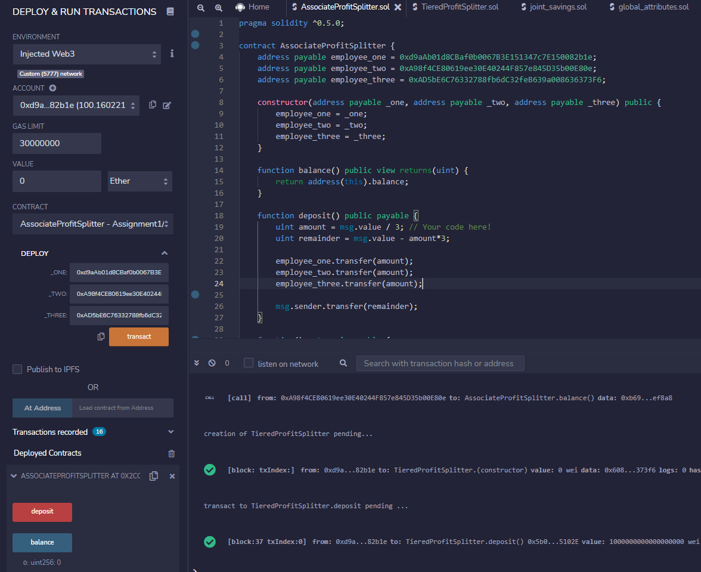

# Looks-like-we-ve-made-our-First-Contract

Your new startup has created its own Ethereum-compatible blockchain to help connect financial institutions, and the team wants to build smart contracts to automate some company finances to make everyone's lives easier, increase transparency, and to make accounting and auditing practically automatic!

## Associate Profit Splitter
Deploy the contract with the three addresses of the employees

Enter the amount you want to split into the value, make sure you have sufficient funds to send.

Accept the metamask confirmation

The transaction should send the split amount to the three employees

